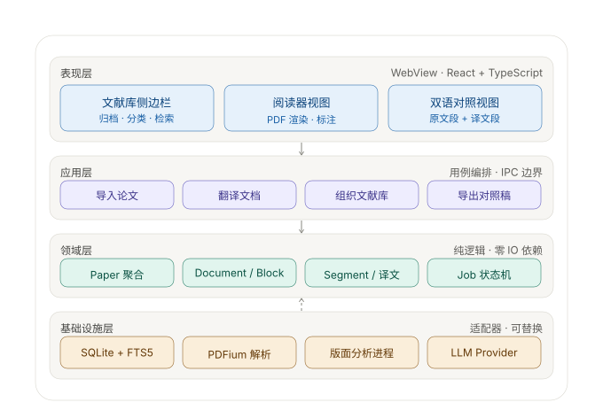

# 01 · 架构总览

## 1. 约束与非目标

架构风格由约束推导而来，不是先选风格再找理由。本项目的约束：

| 约束 | 来源 | 对架构的影响 |
|---|---|---|
| 单用户、单机 | 产品定位 | 不需要服务端，不需要考虑横向扩展 |
| 必须离线可用 | 论文常含未发表内容，且用户可能在无网环境阅读 | 核心功能不依赖网络；翻译能力可降级为本地模型 |
| 需要直接读写本地文件系统 | R1 导入 PDF、AssetStore 存储资源 | 需要原生文件 IO，浏览器沙箱不够 |
| 长驻应用 | 阅读器会长时间开着 | 待机内存敏感 |
| 处理用户私密文献 | 未发表论文、内部技术报告 | 数据默认本地存储；云翻译必须显式授权 |
| 解析与翻译是重活 | PDF 版面分析、LLM 调用 | 必须与 UI 线程隔离，不能阻塞渲染 |

**非目标（明确不做的事）**：

- ❌ 多端实时同步。本地单文件存储，不做 iCloud/Dropbox 直接同步（见 `adr/ADR-007` 的后果章节）
- ❌ 团队协作、共享文献库
- ❌ 服务端渲染、Web 版
- ❌ 微服务。单用户场景下服务拆分的收益为零，只增加运维负担
- ❌ 在 MVP 阶段做论文问答 / RAG。预留存储扩展点，但不实现

## 2. 架构风格

**本地优先的模块化单体（local-first modular monolith）**。

单进程应用：Rust 编译的原生二进制承担后端，前端运行在系统 WebView 中，两者通过 IPC 通信。重活（版面分析、翻译调度）走**任务队列 + 子进程隔离**，而非另起服务。

理由：模块化单体在小型团队 + 边界尚未完全清晰的早期阶段是最优解。它允许后续按限界上下文抽取独立模块（甚至独立进程），而不需要现在就付出分布式系统的代价。

选型对比见 [adr/ADR-001](adr/ADR-001-local-first-modular-monolith.md)。

## 3. 分层结构



四层，自上而下：

| 层 | 职责 | 允许依赖 |
|---|---|---|
| **表现层** | 渲染与交互。React 组件、状态管理、事件订阅 | 应用层（通过 IPC 命令） |
| **应用层** | 用例编排。事务边界、进度上报、错误转换 | 领域层、基础设施层的端口 |
| **领域层** | 业务规则与不变量。**零 IO 依赖**，纯逻辑 | 无。只依赖标准库与纯工具 |
| **基础设施层** | 端口的实现：数据库、文件系统、PDF 解析、LLM 调用 | 领域层定义的端口（实现它） |

### 依赖规则（硬性）

1. **依赖方向单一向上**。表现层 → 应用层 → 领域层。反向依赖一律禁止。
2. **领域层不导入任何 IO 相关 crate**。`rusqlite`、`reqwest`、`tokio::fs` 出现在领域层代码中即为架构违规。
3. **领域层定义端口，基础设施层实现**（依赖倒置）。图中的反向虚线表示这一关系。
4. **跨层调用只允许相邻层**。表现层不得直接调用基础设施层的适配器。

> 这三条规则需要靠**编译期检查**兜底，而不是靠自觉。建议在 `domain` crate 的 `Cargo.toml` 中不声明任何 IO 依赖，让编译器替我们执行规则 2。

### 为什么领域层必须零 IO

两个具体收益，不是原则洁癖：

- **可测试性**。`ParagraphBuilder`（段落重建）和 `JobScheduler`（翻译调度）是本项目最容易出错、最需要反复调参的两块逻辑。零 IO 意味着可以用黄金数据集做纯函数回归测试，不需要启动数据库和 WebView。
- **可移植性**。若未来外壳从 Tauri 换成 Electron，或从桌面换到 Web，领域层与数据流完全不动。参见 `docs/README.md` 的「假设」章节。

## 4. 限界上下文

| 上下文 | 核心概念 | 对外契约 |
|---|---|---|
| **文献库（Library）** | Paper、Collection、Tag、SmartCollection | `LibraryRepository` |
| **导入解析（Ingestion）** | Document、Page、Block、ExtractionJob | `ExtractorPort`、`LayoutPort`、`MetadataPort` |
| **翻译（Translation）** | Segment、Translation、Glossary、TranslationJob | `TranslatorPort` |
| **阅读（Reading）** | ReadingSession、ViewState、Annotation | `SessionRepository` |
| **外部能力（Provider）** | Provider 配置、密钥、配额与限流 | 由翻译上下文通过 `TranslatorPort` 消费 |

上下文映射：**导入解析** 是 **翻译** 的上游（提供 Segment），**文献库** 是 **导入解析** 的上游（提供 Paper 归属）。三者之间通过**领域事件**解耦，而非直接调用。

## 5. 模块划分与职责

### 表现层

| 模块 | 职责 | 关键约束 |
|---|---|---|
| `LibrarySidebar` | 集合树、标签、智能集合、检索入口、拖拽归入 | 大列表必须虚拟滚动 |
| `ReaderView` | pdf.js 渲染、缩放、跳页、文本层、标注锚点 | 分页懒加载，不得一次性渲染全部页面 |
| `ParallelView` | 按 Block 坐标注入译文；译文超长时的撑开 / 折叠 / 浮层三种模式 | 译文层独立于 PDF 画布，不得修改 PDF 内容 |
| `EventBridge` | 订阅后端事件流，增量更新前端 store | 组件卸载时必须解除订阅 |
| `BlockOverrideMenu` | 右键改判块类型 / 合并段落 / 拆分段落 | 改判后必须提示"将重新翻译受影响的 N 段" |

### 应用层（用例）

| 用例 | 职责 |
|---|---|
| `ImportPaper` | 接收文件路径 → 编排解析流水线 → 落库 → 上报进度 |
| `TranslateDocument` | 建立翻译任务 → 筛选可译段 → 提交调度 → 支持取消与重试 |
| `OrganizeLibrary` | 集合 / 标签的增删改、移动、批量操作、重复合并 |
| `OverrideBlock` | 应用用户改判 → 计算受影响的 Segment → 使其失效 |
| `ExportDocument` | 导出双语 Markdown / HTML |

### 领域层

| 模块 | 职责 | 说明 |
|---|---|---|
| `Paper`（聚合根） | 元数据、归属、去重不变量 | 唯一约束：内容哈希 |
| `Document` / `Page` / `Block` | 解析产物、阅读顺序、块类型 | Block 是渲染单位 |
| `ParagraphBuilder` | **Block → Segment 段落重建** | 纯函数，见 `02-domain-model.md` |
| `Segment` / `Translation` | 翻译单元、缓存键、状态机 | Segment 是翻译单位 |
| `JobScheduler` | 并发控制、可见区优先、退避重试策略 | 纯逻辑，不含 IO |
| `BlockClassifier` | 块类型判定与 `translatable` 推导 | 输出需可被用户改判覆盖 |

### 基础设施层

| 模块 | 职责 | 实现的端口 |
|---|---|---|
| `PdfiumExtractor` | PDFium 提取文本、图像、字体、坐标 | `ExtractorPort` |
| `ParserSidecar` | Python 子进程，重版面分析 / OCR | `LayoutPort` |
| `MetadataResolver` | DOI / arXiv / 标题 → 元数据 | `MetadataPort` |
| `SqliteLibraryStore` | SQLite 仓储实现，经写队列串行化 | `LibraryRepository` 等 |
| `FileSystemAssetStore` | 内容寻址的二进制资源存储 | `AssetStore` |
| `LlmProviderAdapter` | OpenAI 兼容 / DeepL / Ollama，流式协议解析 | `TranslatorPort` |
| `KeychainSecretStore` | API Key 存入系统钥匙串 | `SecretStore` |

## 6. 建议目录结构

```
paper-reader/
├── docs/                    # 本文档集
├── src-tauri/               # Rust 后端
│   ├── domain/              # 领域层：零 IO 依赖 crate
│   │   ├── paper/
│   │   ├── document/        # Block、ParagraphBuilder、BlockClassifier
│   │   ├── translation/     # Segment、Translation、JobScheduler
│   │   └── ports/           # 端口 trait 定义
│   ├── application/         # 用例编排
│   ├── infra/               # 端口实现
│   │   ├── sqlite/
│   │   ├── pdf/
│   │   └── llm/
│   └── commands/            # Tauri IPC 边界
├── src/                     # 前端
│   ├── features/
│   │   ├── library/
│   │   ├── reader/
│   │   └── translation/
│   ├── shared/
│   └── app/
└── sidecar/parser/          # Python 版面分析进程
```

**关键点**：`domain/` 是独立 crate，其 `Cargo.toml` 中不包含任何 IO 依赖。这一条比任何文档约定都可靠。

## 7. 并发模型

| 关注点 | 方案 |
|---|---|
| **SQLite 写入** | 单写者。所有写操作经一个写队列串行化。见 `adr/ADR-007` |
| **SQLite 读取** | WAL 模式下并发读，UI 查询不被后台写入阻塞 |
| **翻译并发** | 独立任务池，并发上限可配置（默认 8），受 Provider 限流约束 |
| **解析任务** | 单篇论文同一时刻只允许一个解析任务，避免重复落库 |
| **sidecar 生命周期** | 按需启动、空闲超时退出、崩溃自动重启并降级当前论文 |
| **UI 线程** | 永不执行重活。所有重活经 IPC 交给 Rust 侧 |

**背压**：翻译任务队列有长度上限。超限时前端提示"队列已满"，而不是无限堆积任务。

## 8. 质量属性

| 属性 | 目标 | 验证方式 |
|---|---|---|
| **首屏性能** | 100 页论文解析完成 < 10 秒（M 系列芯片） | 基准测试，取 20 篇真实论文的中位数 |
| **翻译响应** | 点击后首段译文出现 < 2 秒 | 端到端测试 |
| **内存** | 待机 < 150 MB；打开 100 页论文 < 500 MB | 长时间运行观测 |
| **可靠性** | 解析失败不影响其他论文；翻译部分失败可重试 | 故障注入测试 |
| **可测试性** | 领域层测试覆盖率 > 80%，不需要数据库 | 覆盖率报告 |
| **隐私** | 默认零网络请求；云翻译需显式授权并逐条提示 | 网络抓包验证 |
| **可观测性** | 解析与翻译的关键阶段有日志与耗时埋点 | 日志检查 |

## 9. 可观测性

需要埋点的位置（不从 UI 反推，由后端主动上报）：

- 解析流水线：每个阶段的进入 / 退出、耗时、Block 数量、分类置信度分布
- 段落重建：Block 数 → Segment 数的比例（异常比例是重建算法出错的信号）
- 翻译：Provider 首次响应耗时、总耗时、token 消耗、失败率、重试次数
- 缓存：命中率（过低说明缓存键设计有问题）
- sidecar：启动次数、崩溃次数、平均存活时长

> 「段落重建比例」是这套系统最有价值的健康指标。如果一篇 100 页论文重建出的 Segment 数量远超预期（例如超过 3000），几乎可以断定是阅读顺序或聚类算法出了问题。
