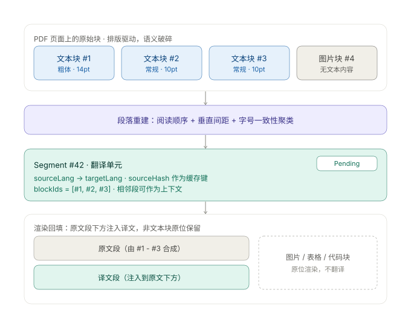

# 02 · 领域模型：Block 与 Segment

**这份文档是本项目最核心的设计。** 需求 R3 能否成立，取决于这两个概念是否正确分离。

## 1. 为什么需要两层

问题在于：**PDF 的文本碎片粒度 ≠ 语义段落粒度**。

| 情况 | 后果 |
|---|---|
| 一个自然段因为一处加粗、一个上标、一次换行被切成 3 个文本块 | 若按块翻译，得到 3 段破碎的烂译文 |
| 一句话被拆分到两页 | 若按块翻译，句子被腰斩 |
| 一张图片被识别为一个文本块 | 若无类型系统，图片会被送去翻译 |

因此需要两个层次的抽象，各自承担不同职责：

| | **Block** | **Segment** |
|---|---|---|
| 是什么 | **渲染单位** | **翻译单位** |
| 粒度 | 与屏幕上某块区域一一对应 | 语义段落，由若干 Block 聚合 |
| 携带 | 坐标 bbox、类型、`translatable` | 原文文本、缓存键、状态机 |
| 数量级 | 100 页论文约 1500 - 3000 个 | 约 Block 数的 1/6 - 1/10 |
| 谁关心 | 渲染层 | 翻译层 |

一次翻译的完整生命周期：**多个 Block → 聚合成一个 Segment → 翻译 → 译文回填到这些 Block 的下方**。

## 2. 数据流示意



## 3. 接口定义

> 以 TypeScript 表述。Rust 侧为等价翻译，字段名用 `snake_case`。

### 3.1 Block

```ts
/** PDF 用户空间坐标，原点在页面左上角，单位 pt */
export interface BBox {
  x: number;
  y: number;
  width: number;
  height: number;
}

export type BlockType =
  | "paragraph"    // 正文段落
  | "heading"      // 章节标题
  | "caption"      // 图表题注
  | "listItem"     // 列表项
  | "figure"       // 图片
  | "table"        // 表格
  | "code"         // 代码块
  | "formula"      // 公式
  | "reference"    // 参考文献条目
  | "runningHead"  // 页眉页脚
  | "pageNumber";  // 页码

export interface Block {
  id: string;
  documentId: string;
  pageIndex: number;
  /** 阅读顺序索引，文档内全局唯一且递增。不等于 bbox 的 y 坐标排序 */
  order: number;
  bbox: BBox;
  type: BlockType;
  /** 是否进入翻译流水线。见 §4 判定规则 */
  translatable: boolean;
  /** figure / table / code / formula 为 null */
  text: string | null;
  /** 内容哈希，指向 AssetStore 中的二进制资源；纯文本块为 null */
  assetRef: string | null;
  /** 块类型判定的置信度 0 - 1。低于阈值需在 UI 上提示可人工校正 */
  confidence: number;
  /** 是否被用户手动改判过。改判后不再被分类器覆盖 */
  overridden: boolean;
  /** 所属 Segment。不可译块恒为 null */
  segmentId: string | null;
}
```

### 3.2 Segment

```ts
export type SegmentStatus = "Pending" | "Running" | "Done" | "Failed";

export interface Segment {
  id: string;
  documentId: string;
  order: number;
  /** BCP-47，如 "en" / "zh" */
  sourceLang: string;
  /** 聚合后的原文 */
  text: string;
  /** sha256(text + 归一化规则版本)。翻译缓存键的组成部分，见 ADR-005 */
  sourceHash: string;
  /** 有序，按阅读顺序 */
  blockIds: string[];
  status: SegmentStatus;
  /** 送翻译时的上下文段落，用于提升术语一致性。可为 null */
  contextBeforeId: string | null;
  contextAfterId: string | null;
  failureReason: string | null;
  retryCount: number;
}
```

### 3.3 Translation

译文是**独立实体**，不是 Segment 的字段。原因是同一个 Segment 可能有多份译文（换模型重译要保留旧的做对比）。

```ts
export interface Translation {
  id: string;
  segmentId: string;
  targetLang: string;
  /** "openai" | "deepl" | "ollama" ... */
  provider: string;
  model: string;
  text: string;
  /** 生成时使用的术语表版本号，用于判断是否需要重译 */
  glossaryVersion: number;
  /** ISO 8601 */
  createdAt: string;
  /** 当前展示的那一份。一个 Segment 至多一份为 true */
  isActive: boolean;
}
```

### 3.4 Document

```ts
export type IngestionStatus = "Pending" | "Running" | "Done" | "Failed" | "Degraded";

export interface Document {
  id: string;
  paperId: string;
  /** 解析器版本。版本升级后可据此判断哪些论文需要重新解析 */
  parserVersion: string;
  pageCount: number;
  /** 整体阅读顺序置信度 0 - 1。低于 0.7 时 UI 应提示"版面识别可能不准" */
  readingOrderConfidence: number;
  status: IngestionStatus;
}
```

## 4. `translatable` 判定规则

`translatable` 由 `BlockClassifier` 判定，结果可被用户改判覆盖。

| BlockType | translatable | 理由 |
|---|---|---|
| `paragraph` | ✅ true | 主体内容 |
| `heading` | ✅ true | 标题也需要翻译（目录、导航） |
| `caption` | ✅ true | 图表题注承载信息，必须翻 |
| `listItem` | ✅ true | 列表项是正文的一部分 |
| `figure` | ❌ false | 无文本。图内文字由 OCR 单独处理，不进入本流水线 |
| `table` | ❌ false | 表格整体不翻。见 [ADR-004](adr/ADR-004-nontext-blocks-not-translated.md) |
| `code` | ❌ false | 翻译代码会破坏语义 |
| `formula` | ❌ false | 公式翻译无意义 |
| `reference` | ❌ false | MVP 阶段不翻。二期可作为可选项 |
| `runningHead` | ❌ false | 页眉页脚反复出现，翻译无价值且会污染缓存 |
| `pageNumber` | ❌ false | 无需翻译 |

### 分类器的输入特征

分类器**不使用机器学习模型**（MVP 阶段保持可解释性），使用以下启发式特征：

| 特征 | 用途 |
|---|---|
| 字体族与字号 | 标题通常字号更大；代码通常等宽；公式字体特殊 |
| 文本内容与页面总文本的重复率 | 跨页重复出现 → 页眉页脚 |
| 边框与填充 | 有完整边框且包含对齐的短文本 → 表格 |
| 文本行长度方差 | 方差极大 → 代码块 |
| 符号密度 | 数学符号 / 运算符占比高 → 公式 |
| 位置 | 页面顶部 / 底部边缘 → 页眉页脚；纯数字居中于页脚 → 页码 |
| bbox 面积占比 | 大于页面 15% 且内部无文本 → 图片 |

**分类器必然出错**，这是设计前提而非缺陷。学术论文里表格常被识别成正文、公式被当成图片、参考文献被当成正文。因此 UI 上的**改判入口是必需功能，不是增强功能**。

## 5. 段落重建算法

`ParagraphBuilder` 是领域层的纯函数，是整个系统最需要反复调参的模块。

```ts
export interface ParagraphBuildOptions {
  /** 垂直间距超过中位行高的多少倍，视为段落边界 */
  paragraphGapRatio: number;      // 默认 1.6
  /** 同段内允许的字号差异（pt） */
  fontSizeTolerance: number;      // 默认 0.5
  /** 同段内允许的左边界偏移（pt） */
  indentTolerance: number;        // 默认 2.0
  /** 跨页续接判定时，页尾 / 页首允许的留白（pt） */
  crossPageGapTolerance: number;  // 默认 8.0
  /** 单个 Segment 的字符数上限，超过后按句子边界二次切分 */
  maxSegmentChars: number;        // 默认 2000
  /** 判定为"可疑段落"的字符数下限 */
  minSegmentChars: number;        // 默认 20
}

export interface SegmentDraft {
  blockIds: string[];
  text: string;
  order: number;
}

export interface ParagraphBuildResult {
  segments: SegmentDraft[];
  stats: {
    blockCount: number;
    translatableBlockCount: number;
    segmentCount: number;
    /** 字符数异常或跨页异常的 segment，需要在 UI 上标记供人工检查 */
    suspiciousSegmentIndexes: number[];
  };
}

export function buildParagraphs(
  blocks: Block[],
  options?: Partial<ParagraphBuildOptions>
): ParagraphBuildResult;
```

### 算法步骤

```
输入：blocks（同一 Document，按 order 升序）
输出：SegmentDraft[]

步骤 1 —— 筛选
  保留 translatable = true 的块，称为"可译块"。
  其余块不参与聚合，但保留在文档中用于渲染。

步骤 2 —— 切分
  遍历可译块序列，在以下任一条件满足处断开：
    a. 块类型发生变化（heading → paragraph 视为边界）
    b. 垂直间距 > paragraphGapRatio × 该页中位行高
    c. 左边界偏移 > indentTolerance（首行缩进是段落开始的强信号）
    d. 字号变化 > fontSizeTolerance
  例外：跨页续接时不断开。判定条件为
    上一块底边到页底距离 < crossPageGapTolerance
    且 当前块顶边到页顶距离 < crossPageGapTolerance

步骤 3 —— 合并
  同一组内的块按 order 拼接 text：
    - 块间以单个空格连接
    - 处理行尾连字符断词：上一块以 "-" 结尾且当前块首字母小写 → 去掉连字符
    - 处理全角 / 半角混排的空白归一化

步骤 4 —— 大段落保护
  若某组字符数 > maxSegmentChars，按句子边界二次切分，
  切分后的 blockIds 必须连续且不重叠。

步骤 5 —— 标注可疑
  字符数 < minSegmentChars 或 > maxSegmentChars × 0.8 的组，
  其索引加入 suspiciousSegmentIndexes，由 UI 提示人工检查。
```

### 跨页续接为什么必须是例外

这是最容易写错的一点。如果不做跨页处理，一篇论文的每个段落在换页处都会被腰斩成两段——译文会出现大量半句话。反过来，如果无条件跨页合并，那么"上一章末尾正好占满整页、下一章标题从新页开始"这种情况会被错误合并。上述的双向留白判定是为了区分这两种情况。

### 测试策略

**黄金数据集**：20 篇真实论文，必须覆盖以下形态，缺一不可：

- 单栏 / 双栏 / 三栏
- 含大量行间公式（如机器学习论文）
- 含跨页长表格
- 含代码清单
- 扫描件（走 OCR 降级路径）
- 中文期刊（横排，单栏）

每个数据集记录三样期望值：`segmentCount` 的合理区间、若干关键段落的 `blockIds`、`suspiciousSegmentIndexes`。

**回归门禁**：算法改动后，`segmentCount` 相对基线变化必须 < 5%，否则需要人工审核并更新基线。这条门禁看似严格，但正是因为重建算法极易在修一个 case 的同时破坏另一个 case。

## 6. 改判与失效传播

用户改判是本系统信任度的最后一道防线，其传播逻辑必须精确。

```
用户改判 Block B（例如把误判为 paragraph 的表格改为 table）
  ↓
1. 更新 B.type、B.translatable，置 B.overridden = true
   （overridden = true 后，重新解析时不得覆盖用户的判定）
  ↓
2. 定位 B 原属的 Segment S
  ↓
3. 在 S 及其前后各一个 Segment 的范围内，重新运行分段
   —— 局部重算，不重跑全文档
  ↓
4. 逐段比对结果：
   ├─ blockIds 未变 且 text 未变  → 保持原状，译文继续有效
   └─ text 发生变化              → 新建 Segment id，status = Pending
                                   旧译文保留但 isActive = false
  ↓
5. 向前端推送事件：
   library://changed          （侧边栏计数变化）
   translation://segment      （受影响的段落状态）
```

**为什么用局部重算而不是全量**：全量重算会丢掉整篇论文已验证过的段落划分，用户改一个块就要重新翻译全文，体验不可接受。

## 7. 领域不变量

实现中必须保证以下不变量，违反即为 bug：

| 编号 | 不变量 |
|---|---|
| INV-1 | 每个 `translatable = true` 的 Block 恰好属于 0 或 1 个 Segment |
| INV-2 | `translatable = false` 的 Block，其 `segmentId` 必须为 `null` |
| INV-3 | `Segment.blockIds` 按 Block 的 `order` 升序，且所有 Block 属于同一 Document |
| INV-4 | `Segment.sourceHash` 由当前 `text` 计算得出；`text` 变更则 `sourceHash` 必须变更 |
| INV-5 | 一个 Segment 至多有一份 `isActive = true` 的 Translation |
| INV-6 | Segment 的 `blockIds` 集合整体不重叠：不同 Segment 不得共享 Block |
| INV-7 | `overridden = true` 的 Block，其 `type` 与 `translatable` 不被任何自动过程修改 |

> INV-4 与 INV-5 直接决定翻译缓存的正确性：hash 不对会导致显示旧译文，isActive 不唯一会导致界面闪烁。
