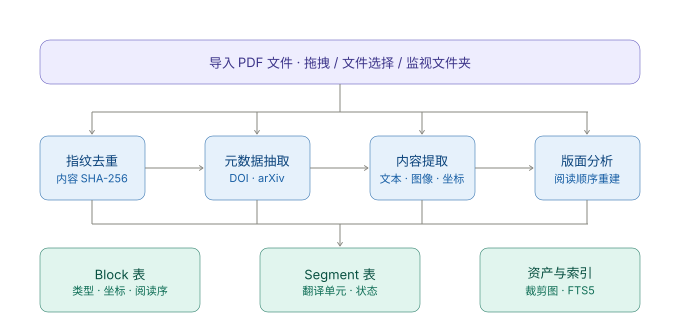
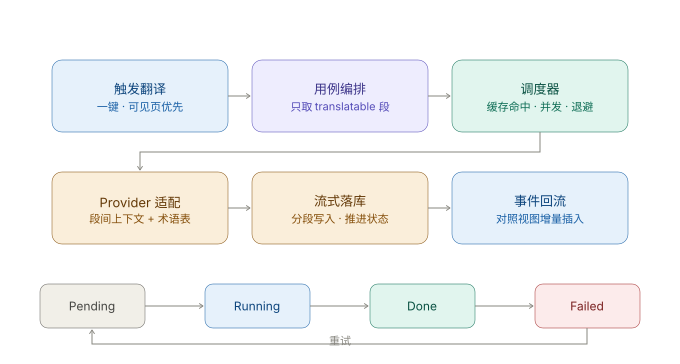

# 03 · 核心数据流

本项目只有两条主干数据流：**导入解析**（产出可渲染、可翻译的结构）与**翻译调度**（产出译文并增量回填）。

## 1. 数据流 A：导入与解析



### 阶段说明

| 阶段 | 输入 | 输出 | 失败处理 |
|---|---|---|---|
| **1. 指纹去重** | 文件路径 | 内容 SHA-256 | 无失败路径。命中已有哈希则提示"已存在同一论文"并允许用户选择覆盖 / 跳过 / 另存 |
| **2. 元数据抽取** | 文件 + 哈希 | Paper 元数据 | **可失败**。DOI 解析失败时退化为从首页文本抽取标题，再失败则标记为"待手动补充" |
| **3. 内容提取** | 文件 | 文本 + 图像 + 字体 + 坐标 | **可失败**。加密 PDF 提示输入密码；损坏文件直接判定 Failed |
| **4. 版面分析** | 提取产物 | 阅读顺序 + 块类型 | **可降级**。sidecar 崩溃 → 重试一次 → 仍失败则走内置规则版分析器 |
| **5. 段落重建** | Block 列表 | Segment 列表 | 无失败路径（纯函数）。但可能产出可疑段落，标记供人工检查 |

### 关键设计点

**① Block 与 Segment 分表存储，Segment 通过 `blockIds` 反向引用 Block。**

这不是规范化洁癖，而是为了**让改判不需要重跑解析**。用户把某个块切成"不翻译"时，只需重建受影响的 Segment，不必重新解析 PDF（解析是秒级到十秒级的操作，无法接受每次改判都跑）。

**② 解析必须幂等。**

同一文件重复导入同一个 `parserVersion`，结果必须完全一致。`parserVersion` 变化时，Document 标记为需要重新解析，但**用户的 `overridden` 判定必须保留**（见 INV-7）。

**③ 落库必须在事务中完成。**

一次解析产出上千行 Block。若中途崩溃，出现"一半 Block"的 Document 会让渲染层崩溃。整个 Document 的 Block 与 Segment 写入必须在**单个事务**内提交。

### 无排版顺序的论文（扫描件）

扫描件没有文字层，内容提取阶段拿不到文本。此时：

1. 检测：某页提取到的文本字符数 < 阈值（默认 50）且页面存在大幅图像 → 判定为扫描页
2. 降级：对该页走 OCR 路径
3. 若 OCR 不可用或失败 → `Document.status = Degraded`，该页仅渲染原图不可翻译

## 2. 数据流 B：翻译调度



### 阶段说明

| 阶段 | 职责 | 要点 |
|---|---|---|
| **1. 触发** | 用户点击"一键翻译" | 请求携带**当前可见页范围**，用于计算优先级 |
| **2. 用例编排** | 拉取文档全部 Segment，过滤状态 | 只取 `status ∈ {Pending, Failed}` 的 Segment；`Done` 直接跳过 |
| **3. 调度** | 缓存命中判定 → 并发控制 → 优先级排序 | 详见下方 §2.1 |
| **4. Provider 适配** | 组装请求：段落文本 + 上下文 + 术语表 | 详见 §2.2 |
| **5. 流式落库** | 逐 token 累积，完成后写入 Translation | 流式过程中不写库，仅在完成时以单事务写入 |
| **6. 事件回流** | 推送状态变化给前端 | 前端增量插入译文，不整页重绘 |

### 2.1 调度器

**优先级排序**（高到低）：

1. 当前可见页的 Segment
2. 可见页之后 3 页内的 Segment（预读）
3. 其余按 `order` 升序

**缓存命中判定**：

```
cacheKey = sha256(sourceHash ‖ targetLang ‖ provider ‖ model ‖ glossaryVersion)
```

需先查 Translation 表。命中则直接置 `status = Done` 并推送事件，**不发起网络请求**。

> `glossaryVersion` 必须计入缓存键。否则用户新增术语后，旧译文会因缓存命中而不被更新。

**并发与限流**：

- 全局并发上限可配置，默认 8
- 每个 Provider 可单独设置 RPM / TPM 上限
- 收到 429 时按指数退避重试，退避上限 60 秒
- 连续失败 3 次后该 Segment 置 `Failed`，不再自动重试；UI 提供手动重试

**取消语义**：用户点击取消时，已完成的段落**保留**，正在进行的请求 abort，`Running` 状态回滚为 `Pending`。

### 2.2 Provider 请求组装

单次请求的内容不是孤立的段落，而是：

```
[系统提示]
你是学术论文翻译引擎。保持术语准确、句式严谨，不增删内容。

[术语表]（若存在）
attention → 注意力
embedding → 嵌入

[上下文 · 前一段原文]（不翻译，仅供理解）
...

[待翻译段落]
...（需要翻译的原文）

[上下文 · 后一段原文]（不翻译，仅供理解）
...
```

**上下文字段必须明确标注"不翻译"**，否则 LLM 会把上下文一起翻译输出。这是实测中最容易踩的坑。

上下文窗口默认前后各 1 段（`contextWindow` 配置项）。加大窗口能提升术语一致性，但会显著增加 token 成本。

### 2.3 流式落库的取舍

流式 token **不逐字写库**。原因：100 页论文约 300 个 Segment，若每个 token 都是一次数据库写入，写队列会被打满，拖慢其他所有操作。

正确做法：

- 流式 token 只在**内存中累积**，并通过事件推送给前端做即时显示（用户看到文字在"生长"）
- 段落完成后，以**单事务**写入 Translation 与 Segment 状态
- 若此时进程崩溃，该段落回到 `Pending`，重译即可

用户看到的效果与逐字写库一致，但数据库压力下降几个数量级。

## 3. 事件目录

后端 → 前端的事件，前端 `EventBridge` 模块统一订阅。

| 事件名 | 触发时机 | Payload |
|---|---|---|
| `ingestion://progress` | 解析流水线每个阶段推进 | `{ paperId, stage, percent, detail? }` |
| `ingestion://done` | 解析完成或降级 | `{ paperId, documentId, status, blockCount, segmentCount }` |
| `ingestion://failed` | 解析失败 | `{ paperId, stage, reason }` |
| `translation://segment` | 单个 Segment 状态变化 | `{ segmentId, status, partialText?, translationId? }` |
| `translation://progress` | 批量进度汇总 | `{ documentId, done, total, failed }` |
| `translation://done` | 整个翻译任务结束 | `{ documentId, total, succeeded, failed }` |
| `library://changed` | 文献库结构变化 | `{ affectedPaperIds, reason }` |
| `provider://quota` | Provider 配额告警 | `{ provider, remaining, resetAt? }` |

**约束**：

- 事件名采用 `域://事件` 格式，禁止自由命名
- 事件 Payload 必须可序列化，不得包含二进制
- `translation://segment` 是最高频事件，前端必须做节流合并后再触发渲染

## 4. 失败与降级路径

系统的设计原则：**任何单点失败都只应影响单篇论文或单个段落，不得让应用不可用。**

| 失败点 | 影响范围 | 降级行为 |
|---|---|---|
| sidecar 崩溃 | 当前论文 | 重启 sidecar 重试一次；仍失败则用内置规则版分析器，`Document.status = Degraded` 并提示用户 |
| 内置分析器也失败 | 当前论文 | 退化为"纯文本模式"：仅按 y 坐标顺序串接文本，不做段落重建。翻译仍可用但质量下降，UI 明确提示 |
| 元数据抽取失败 | 当前论文 | 标记"待手动补充"，不影响阅读与翻译 |
| 扫描件无 OCR | 单页 | 该页仅渲染原图，标记为不可翻译 |
| Provider 429 | 单段落 | 指数退避重试至上限 |
| Provider 5xx / 超时 | 单段落 | 重试 3 次后置 Failed，UI 标红可手动重试 |
| Provider 凭证失效 | 全部段落 | 立即停止队列，弹出凭证配置引导，已完成的段落保留 |
| SQLite 写失败 | 全部 | 写队列进入错误状态并在 UI 顶部告警，只读模式继续可用 |
| 网络断开 | 全部 | 已在队列中的任务保留，恢复后继续；本地 Provider 不受影响 |

## 5. 缓存与失效规则

| 缓存对象 | 键 | 失效条件 |
|---|---|---|
| 译文 | `sha256(sourceHash ‖ targetLang ‖ provider ‖ model ‖ glossaryVersion)` | 源文本变化、术语表版本变化 |
| 解析产物 | `sha256(文件内容) ‖ parserVersion` | `parserVersion` 升级、用户强制重解析 |
| 页面缩略图 | `sha256(文件内容) ‖ pageIndex ‖ 缩略图尺寸` | 文件变化 |

**术语表变更的处理**：`glossaryVersion` 递增后，所有 Segment 的旧译文仍然保留（`isActive = false`），但状态重置为 `Pending`。用户可以选择"仅重译未完成段落"或"全文重译"。

> 不做自动全文重译。用户新增一个术语就触发 300 段重新翻译，会产生不可接受的时间与费用开销。

## 6. 端到端时序（翻译的典型一次）

```
用户点击「一键翻译」（当前在看第 5 页）
  │
  ├─ 前端 invoke('translate_document', { documentId, visibleRange: [5, 6] })
  │
  ├─ 后端 TranslateDocument 用例
  │    ├─ 查 Segment 表：共 287 段，其中 12 段已 Done → 跳过
  │    ├─ 275 段进入候选
  │    ├─ 缓存命中检查：命中 3 段（页眉重复段落）→ 直接置 Done 并推送事件
  │    └─ 272 段入调度队列，优先级：第 5-8 页的 9 段排最前
  │
  ├─ 调度器并发 8 开始派发
  │    └─ 第 5 页第 3 段 → Provider → 流式返回
  │         ├─ 每收到一段 token → emit('translation://segment', { partialText })
  │         └─ 前端逐字渲染译文（约 1.2 秒后用户看到第一段译文）
  │
  ├─ 段落完成 → 单事务写 Translation + Segment.status = Done
  │
  └─ 全部完成 → emit('translation://done', { total: 287, succeeded: 284, failed: 3 })
       └─ 前端在侧边栏与文档头部标记 3 段失败，提供「重试失败段落」按钮
```
