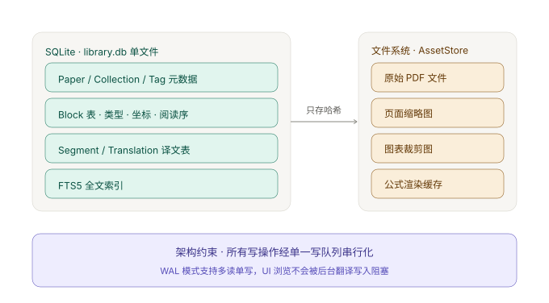

# 04 · 存储设计

## 1. 为什么是 SQLite

决策记录见 [ADR-007](adr/ADR-007-sqlite-as-primary-store.md)。这里只给结论和数据依据。

**数据规模**：一篇 100 页论文约产生 1500 - 3000 个 Block、250 - 400 个 Segment。若用户积累 500 篇论文，Block 表达到百万行量级。SQLite 处理此量级毫无压力（其设计上限是 TB 级），但**跨论文查询必须走索引**。

**查询形态决定选型**：用户会提出的查询几乎全是跨实体、带条件、需要 join 的。

```sql
-- 「找出 2023 年之后、打过 GNN 标签、且正文提到 attention 的论文」
SELECT DISTINCT p.id, p.title
FROM paper p
JOIN paper_tag pt      ON pt.paper_id = p.id
JOIN tag t             ON t.id = pt.tag_id
JOIN document d        ON d.paper_id = p.id
JOIN segment s         ON s.document_id = d.id
JOIN segment_fts f     ON f.rowid = s.rowid
WHERE p.year >= 2023
  AND t.name = 'GNN'
  AND segment_fts MATCH 'attention'
ORDER BY p.year DESC;
```

一条 SQL 解决的问题，在「文件夹 + JSON」方案里需要打开并解析 500 个文件。

**被排除的方案**：

| 方案 | 致命问题 |
|---|---|
| 文件夹 + JSON | 跨论文查询需全量扫描；改一个字段要重写整个文件（翻译过程中每段完成都要落库，直接变成灾难）；无事务，崩溃即损坏 |
| IndexedDB | 无 join、无 FTS；数据绑定 WebView 的 origin，清缓存即丢；Rust 后端访问不到 |
| PostgreSQL | 要求用户为单机阅读器额外安装数据库服务，收益在单用户场景全部用不上 |

## 2. 存储边界



**规则：数据库不存大二进制。**

| 存入 SQLite | 存入文件系统（AssetStore） |
|---|---|
| 元数据、集合、标签 | 原始 PDF |
| Block 的坐标、类型、文本 | 页面缩略图 |
| Segment 源文本与状态 | 图表裁剪图 |
| 译文 | 公式渲染缓存 |
| 全文索引 | |

违反这条规则的代价：库文件膨胀到 GB 级，`VACUUM` 耗时剧增，备份与恢复变慢。数据库只保存**内容哈希**，通过哈希在 AssetStore 中寻址。

### 文件系统布局

```
<AppData>/PaperReader/
├── library.db
├── library.db-wal
├── library.db-shm
└── assets/
    └── ab/cd/abcd1234.../          # 内容寻址，取哈希前 4 位做两级分片
        ├── original.pdf
        ├── thumb-p3.jpg
        └── crop-p3-b12.png
```

**内容寻址的好处**：同一份 PDF 被导入两次只占用一份磁盘；资源损坏可直接通过哈希校验发现；AssetStore 可以安全地被垃圾回收（删除无引用的哈希目录）。

## 3. 连接初始化

```sql
PRAGMA journal_mode = WAL;      -- 允许「多读单写」并发
PRAGMA foreign_keys = ON;       -- SQLite 默认关闭，必须显式开启
PRAGMA synchronous = NORMAL;    -- WAL 模式下足够安全，性能显著优于 FULL
PRAGMA busy_timeout = 5000;     -- 避免瞬时锁冲突直接报错
PRAGMA temp_store = MEMORY;
```

## 4. 完整 Schema

> 所有时间字段为 ISO 8601 UTC 字符串。布尔字段用 `INTEGER` 存 0 / 1。

### 4.1 文献库

```sql
CREATE TABLE paper (
  id               TEXT PRIMARY KEY,
  content_hash     TEXT NOT NULL UNIQUE,        -- 原始 PDF 的 SHA-256，去重依据
  file_name        TEXT NOT NULL,
  asset_ref        TEXT NOT NULL,               -- AssetStore 中的哈希目录名
  file_size        INTEGER NOT NULL,
  title            TEXT,
  authors          TEXT,                        -- JSON 数组
  year             INTEGER,
  venue            TEXT,
  doi              TEXT,
  arxiv_id         TEXT,
  abstract         TEXT,
  lang             TEXT,                        -- BCP-47
  ingestion_status TEXT NOT NULL DEFAULT 'Pending'
                   CHECK (ingestion_status IN ('Pending','Running','Done','Failed','Degraded')),
  metadata_source  TEXT,                        -- 'doi' | 'arxiv' | 'heuristic' | 'manual'
  added_at         TEXT NOT NULL,
  updated_at       TEXT NOT NULL,
  last_opened_at   TEXT,
  reading_progress REAL NOT NULL DEFAULT 0      -- 0.0 - 1.0
);
CREATE INDEX idx_paper_added  ON paper(added_at DESC);
CREATE INDEX idx_paper_year   ON paper(year);
CREATE INDEX idx_paper_status ON paper(ingestion_status);

CREATE TABLE collection (
  id         TEXT PRIMARY KEY,
  parent_id  TEXT REFERENCES collection(id) ON DELETE CASCADE,
  name       TEXT NOT NULL,
  sort_order INTEGER NOT NULL DEFAULT 0,
  created_at TEXT NOT NULL,
  UNIQUE(parent_id, name)
);
CREATE INDEX idx_collection_parent ON collection(parent_id);

CREATE TABLE tag (
  id         TEXT PRIMARY KEY,
  name       TEXT NOT NULL UNIQUE,
  color      TEXT,
  created_at TEXT NOT NULL
);

CREATE TABLE paper_collection (
  paper_id      TEXT NOT NULL REFERENCES paper(id) ON DELETE CASCADE,
  collection_id TEXT NOT NULL REFERENCES collection(id) ON DELETE CASCADE,
  added_at      TEXT NOT NULL,
  PRIMARY KEY (paper_id, collection_id)
);
CREATE INDEX idx_pc_collection ON paper_collection(collection_id);

CREATE TABLE paper_tag (
  paper_id TEXT NOT NULL REFERENCES paper(id) ON DELETE CASCADE,
  tag_id   TEXT NOT NULL REFERENCES tag(id) ON DELETE CASCADE,
  PRIMARY KEY (paper_id, tag_id)
);
CREATE INDEX idx_pt_tag ON paper_tag(tag_id);

-- 智能集合是「保存的查询条件」，不存储成员列表
CREATE TABLE smart_collection (
  id         TEXT PRIMARY KEY,
  name       TEXT NOT NULL,
  query_json TEXT NOT NULL,
  created_at TEXT NOT NULL
);
```

### 4.2 解析产物

```sql
CREATE TABLE document (
  id                       TEXT PRIMARY KEY,
  paper_id                 TEXT NOT NULL UNIQUE REFERENCES paper(id) ON DELETE CASCADE,
  parser_version           TEXT NOT NULL,
  page_count               INTEGER NOT NULL,
  reading_order_confidence REAL NOT NULL DEFAULT 0,   -- 0 - 1
  status                   TEXT NOT NULL DEFAULT 'Pending'
                           CHECK (status IN ('Pending','Running','Done','Failed','Degraded')),
  degraded_reason          TEXT,
  parsed_at                TEXT
);

CREATE TABLE page (
  id                 TEXT PRIMARY KEY,
  document_id        TEXT NOT NULL REFERENCES document(id) ON DELETE CASCADE,
  page_index         INTEGER NOT NULL,
  width              REAL NOT NULL,
  height             REAL NOT NULL,
  thumbnail_ref      TEXT,
  is_scanned         INTEGER NOT NULL DEFAULT 0,
  median_line_height REAL                        -- 段落重建依赖此值，解析时计算一次
);
CREATE UNIQUE INDEX idx_page_doc_index ON page(document_id, page_index);

CREATE TABLE block (
  id           TEXT PRIMARY KEY,
  document_id  TEXT NOT NULL REFERENCES document(id) ON DELETE CASCADE,
  page_index   INTEGER NOT NULL,
  read_order   INTEGER NOT NULL,                 -- 阅读顺序，文档内全局递增
  bbox_x       REAL NOT NULL,
  bbox_y       REAL NOT NULL,
  bbox_w       REAL NOT NULL,
  bbox_h       REAL NOT NULL,
  type         TEXT NOT NULL
               CHECK (type IN ('paragraph','heading','caption','listItem','figure',
                               'table','code','formula','reference','runningHead','pageNumber')),
  translatable INTEGER NOT NULL,                 -- 0 / 1
  text         TEXT,
  asset_ref    TEXT,
  confidence   REAL NOT NULL DEFAULT 1.0,
  overridden   INTEGER NOT NULL DEFAULT 0,
  segment_id   TEXT REFERENCES segment(id) ON DELETE SET NULL,
  font_size    REAL,
  font_family  TEXT,
  is_monospace INTEGER NOT NULL DEFAULT 0
);
CREATE INDEX idx_block_doc_order ON block(document_id, read_order);
CREATE INDEX idx_block_segment   ON block(segment_id, read_order);
CREATE INDEX idx_block_page      ON block(document_id, page_index);
```

> **注意：不需要 `segment_block` 关联表，也不需要把 `blockIds` 存成 JSON。**
>
> 领域不变量 INV-1 保证了「每个可译 Block 至多属于一个 Segment」，因此 `block.segment_id` 这一个外键就足够表达关系；而 `blockIds` 的**顺序**由 `block.read_order` 天然编码。多存一张表或一个 JSON 字段都是冗余，且 JSON 数组无法被索引。
>
> 这条简化直接来自领域模型，是「先把领域想清楚再设计表」的收益。

### 4.3 翻译

```sql
CREATE TABLE segment (
  id                TEXT PRIMARY KEY,
  document_id       TEXT NOT NULL REFERENCES document(id) ON DELETE CASCADE,
  read_order        INTEGER NOT NULL,
  source_lang       TEXT NOT NULL,
  text              TEXT NOT NULL,
  source_hash       TEXT NOT NULL,
  status            TEXT NOT NULL DEFAULT 'Pending'
                    CHECK (status IN ('Pending','Running','Done','Failed')),
  context_before_id TEXT REFERENCES segment(id) ON DELETE SET NULL,
  context_after_id  TEXT REFERENCES segment(id) ON DELETE SET NULL,
  failure_reason    TEXT,
  retry_count       INTEGER NOT NULL DEFAULT 0,
  char_count        INTEGER NOT NULL,
  suspicious        INTEGER NOT NULL DEFAULT 0
);
CREATE UNIQUE INDEX idx_segment_doc_order ON segment(document_id, read_order);
CREATE INDEX idx_segment_status ON segment(document_id, status);
CREATE INDEX idx_segment_hash   ON segment(source_hash);

CREATE TABLE translation (
  id               TEXT PRIMARY KEY,
  segment_id       TEXT NOT NULL REFERENCES segment(id) ON DELETE CASCADE,
  target_lang      TEXT NOT NULL,
  provider         TEXT NOT NULL,
  model            TEXT NOT NULL,
  text             TEXT NOT NULL,
  glossary_version INTEGER NOT NULL DEFAULT 0,
  cache_key        TEXT NOT NULL,
  created_at       TEXT NOT NULL,
  latency_ms       INTEGER,
  token_usage      INTEGER,
  is_active        INTEGER NOT NULL DEFAULT 0
);
CREATE UNIQUE INDEX idx_translation_cache  ON translation(cache_key);
CREATE INDEX        idx_translation_segment ON translation(segment_id);
-- 用部分唯一索引在数据库层强制 INV-5：一个 Segment 至多一份 active 译文
CREATE UNIQUE INDEX idx_translation_active ON translation(segment_id) WHERE is_active = 1;
```

### 4.4 用户改判的持久化

改判必须**在重新解析后依然存活**。但重新解析会重建 Block（id 变化），因此不能把改判挂在 `block.id` 上。解决方案是引入一个基于内容与位置的**锚点**：

```sql
CREATE TABLE override_anchor (
  id          TEXT PRIMARY KEY,
  document_id TEXT NOT NULL REFERENCES document(id) ON DELETE CASCADE,
  -- sha256(page_index ‖ 取整后的 bbox ‖ text 前 32 字符)
  anchor_hash TEXT NOT NULL,
  type        TEXT NOT NULL,
  translatable INTEGER NOT NULL,
  created_at  TEXT NOT NULL,
  UNIQUE(document_id, anchor_hash)
);
CREATE INDEX idx_override_doc ON override_anchor(document_id);
```

解析完成后，用同样的规则计算每个 Block 的 `anchor_hash` 并查表；命中则套用用户的判定并置 `block.overridden = 1`。

> 这个表不能省。否则用户辛苦校正过的几十处块类型，会在一次解析器升级后全部丢失。

### 4.5 术语表

```sql
CREATE TABLE glossary_term (
  id         TEXT PRIMARY KEY,
  source     TEXT NOT NULL,
  target     TEXT NOT NULL,
  lang_pair  TEXT NOT NULL,                     -- 如 'en→zh'
  note       TEXT,
  created_at TEXT NOT NULL,
  UNIQUE(source, lang_pair)
);

-- 单行表，任何术语变更都必须递增 version
CREATE TABLE glossary_meta (
  id      INTEGER PRIMARY KEY CHECK (id = 1),
  version INTEGER NOT NULL DEFAULT 0
);
```

`glossary_version` 参与翻译缓存键计算。应用层在术语增删改的**同一事务内**执行 `UPDATE glossary_meta SET version = version + 1`。

### 4.6 阅读与任务

```sql
CREATE TABLE annotation (
  id         TEXT PRIMARY KEY,
  paper_id   TEXT NOT NULL REFERENCES paper(id) ON DELETE CASCADE,
  page_index INTEGER NOT NULL,
  block_id   TEXT REFERENCES block(id) ON DELETE SET NULL,
  kind       TEXT NOT NULL CHECK (kind IN ('highlight','note','bookmark')),
  color      TEXT,
  note       TEXT,
  created_at TEXT NOT NULL
);
CREATE INDEX idx_annotation_paper ON annotation(paper_id, page_index);

CREATE TABLE job (
  id           TEXT PRIMARY KEY,
  kind         TEXT NOT NULL CHECK (kind IN ('ingestion','translation')),
  target_id    TEXT NOT NULL,                   -- paper_id 或 document_id
  status       TEXT NOT NULL,
  progress     REAL NOT NULL DEFAULT 0,
  total_items  INTEGER,
  done_items   INTEGER NOT NULL DEFAULT 0,
  failed_items INTEGER NOT NULL DEFAULT 0,
  error        TEXT,
  created_at   TEXT NOT NULL,
  updated_at   TEXT NOT NULL
);
CREATE INDEX idx_job_target ON job(kind, target_id, created_at DESC);
```

### 4.7 全文检索

```sql
-- 文献元数据检索（侧边栏搜索框）
CREATE VIRTUAL TABLE paper_fts USING fts5(
  title, authors, abstract, venue,
  content='paper', content_rowid='rowid',
  tokenize='trigram'
);

-- 正文检索（「哪些论文提到 attention」）
CREATE VIRTUAL TABLE segment_fts USING fts5(
  text,
  content='segment', content_rowid='rowid',
  tokenize='trigram'
);

-- 外部内容表必须用触发器保持同步
CREATE TRIGGER paper_ai AFTER INSERT ON paper BEGIN
  INSERT INTO paper_fts(rowid, title, authors, abstract, venue)
  VALUES (new.rowid, new.title, new.authors, new.abstract, new.venue);
END;
CREATE TRIGGER paper_ad AFTER DELETE ON paper BEGIN
  INSERT INTO paper_fts(paper_fts, rowid, title, authors, abstract, venue)
  VALUES ('delete', old.rowid, old.title, old.authors, old.abstract, old.venue);
END;
CREATE TRIGGER paper_au AFTER UPDATE ON paper BEGIN
  INSERT INTO paper_fts(paper_fts, rowid, title, authors, abstract, venue)
  VALUES ('delete', old.rowid, old.title, old.authors, old.abstract, old.venue);
  INSERT INTO paper_fts(rowid, title, authors, abstract, venue)
  VALUES (new.rowid, new.title, new.authors, new.abstract, new.venue);
END;

CREATE TRIGGER segment_ai AFTER INSERT ON segment BEGIN
  INSERT INTO segment_fts(rowid, text) VALUES (new.rowid, new.text);
END;
CREATE TRIGGER segment_ad AFTER DELETE ON segment BEGIN
  INSERT INTO segment_fts(segment_fts, rowid, text) VALUES ('delete', old.rowid, old.text);
END;
CREATE TRIGGER segment_au AFTER UPDATE OF text ON segment BEGIN
  INSERT INTO segment_fts(segment_fts, rowid, text) VALUES ('delete', old.rowid, old.text);
  INSERT INTO segment_fts(rowid, text) VALUES (new.rowid, new.text);
END;
```

**关于 `tokenize='trigram'`**：FTS5 默认的 `unicode61` 按字切分中文，检索效果很差。`trigram` 把文本切成三字符滑动窗口，对中英文混排都可用。代价是索引体积明显增大（约为原文的 3-5 倍），且 `MATCH` 的查询串长度需 ≥ 3 个字符。

> 这个坑不做中文检索不会暴露。如果目标用户主要读英文论文、搜索也只搜英文，可以改回 `unicode61` 并在需要时启用 `porter` 词干。

**带高亮的搜索结果**：

```sql
SELECT p.id, p.title,
       snippet(segment_fts, 0, '<mark>', '</mark>', '…', 16) AS excerpt,
       bm25(segment_fts) AS score
FROM segment_fts f
JOIN segment s  ON s.rowid = f.rowid
JOIN document d ON d.id = s.document_id
JOIN paper p    ON p.id = d.paper_id
WHERE segment_fts MATCH ?
ORDER BY score
LIMIT 50;
```

`snippet()` 直接产出侧边栏搜索结果所需的「标题 + 高亮摘要」，无需在应用层做文本处理。

## 5. 单写者约束

**SQLite 是单写者模型。** WAL 模式提供的是「多读单写」，不是多写。

```
        ┌──────────────┐
        │  写队列（唯一） │  ← 专用线程 + 唯一写连接
        └───────┬──────┘
                │
   ┌────────────┼────────────┐
   │            │            │
 解析落库    翻译落库    用户操作
                │
        ┌───────┴──────┐
        │  library.db  │
        └───────┬──────┘
                │
   ┌────────────┼────────────┐
   │            │            │
 侧边栏查询  阅读器加载  搜索
     （读连接池，可并发）
```

**实现要求**：

1. 全局唯一一个写连接，由专用线程或 `tokio` task 持有
2. 所有写操作（含单行 UPDATE）必须提交到写队列，**不得**有第二个写连接
3. 读操作使用独立连接池，数量不限，WAL 保证读取不被写入阻塞
4. 写队列需支持**批量合并**：翻译落库时把多个 Segment 的写入合并为一个事务

**违反的后果**：并发写触发 `SQLITE_BUSY`，重试逻辑会导致不可预期的延迟尖刺；严重时（未开启 WAL 或 busy_timeout 过短）直接抛错。

## 6. 迁移机制

使用 SQLite 内置的 `PRAGMA user_version` 作为版本号，迁移脚本按序号存放：

```
src-tauri/infra/sqlite/migrations/
├── 001_init.sql
├── 002_add_override_anchor.sql
└── 003_add_fts_trigram.sql
```

启动时：

```
读取 PRAGMA user_version → 记为 current
for n in (current + 1) .. latest:
    在单个事务中执行 migrations/{n}.sql
    PRAGMA user_version = n
    提交
```

**规则**：

- 迁移文件一旦发布**不得修改**，只能追加新文件
- 每个迁移必须在单事务内完成（SQLite 支持 DDL 事务）
- 迁移失败必须整体回滚且**拒绝启动应用**，而不是带病运行
- 迁移前自动备份 `library.db` 为 `library.db.bak-{user_version}`，保留最近 3 份

## 7. 备份与已知限制

**备份**：整个文献库就是 `library.db` + `assets/` 两部分。备份 = 复制这两项。建议 UI 提供「导出文献库」功能，打包为 zip。

**已知限制（必须在 UI 中告知用户）**：

| 限制 | 说明 | 缓解 |
|---|---|---|
| **不可放网盘同步** | iCloud / Dropbox / OneDrive 两端同时修改 SQLite 文件会导致冲突甚至损坏 | UI 明确警告；二期实现导出 / 导入合并 |
| **不支持多用户并发** | 单写者模型 | 符合单机定位，不需要缓解 |
| **库文件随论文数增长** | 500 篇约 1-3 GB（不含 assets） | 提供 VACUUM 入口；监控并提示 |
