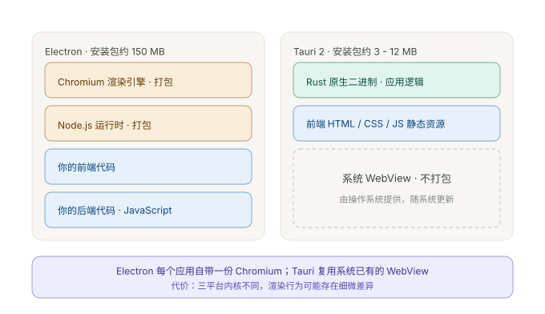
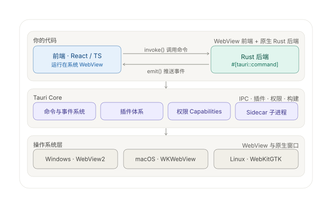

# 05 · 技术选型

## 1. 桌面外壳：Tauri 2

### 1.1 它是什么

Tauri 是一个跨平台应用框架：**用 Web 技术写界面、用 Rust 写后端逻辑、打包成原生桌面（也支持移动端）应用**。当前稳定版 **2.11**（2026-07）；2.0 于 2024-10 发布 GA。

它与 Electron 的根本差异在于**不打包浏览器**：



Electron 把 Chromium 与 Node.js 一起塞进每个应用（安装包约 150 MB）；Tauri 复用操作系统已有的 WebView，只打包 Rust 二进制和前端静态资源（安装包约 3 - 12 MB）。

### 1.2 运行时结构



前后端不是共享内存，而是**消息传递的 IPC 通道**：前端 `invoke()` 调后端命令，后端 `emit()` 往前端推事件。这个边界是硬隔离的。

```rust
// src-tauri/src/commands/translation.rs —— 后端
#[tauri::command]
async fn translate_document(app: AppHandle, document_id: String) -> Result<(), String> {
    app.emit("translation://segment", SegmentEvent { /* ... */ })
        .map_err(|e| e.to_string())?;
    Ok(())
}
```

```ts
// 前端
import { invoke } from "@tauri-apps/api/core";
import { listen } from "@tauri-apps/api/event";

await invoke("translate_document", { documentId: "d_001" });
const unlisten = await listen<SegmentEvent>("translation://segment", (e) => {
  applySegmentUpdate(e.payload);
});
// 组件卸载时必须调用 unlisten()
```

这两行恰好对应 `01-architecture-overview.md` 中的**应用层（Use Case）**与 `EventBridge` 模块。

### 1.3 Tauri 2 相对 1.x 的变化

若参考资料是旧版，以下四处已经过时：

| 变化 | 内容 | 对本项目的影响 |
|---|---|---|
| **移动端支持** | 同一套代码可编译到 iOS / Android | 非目标，但未来若做移动版可复用后端 |
| **权限系统重做** | 从 `allowlist` 换成 **capability 模型**，默认拒绝一切，需显式授权 | 见 §1.4 |
| **IPC 重构** | JSON-RPC 风格，支持**流式响应**（Channel）与双向通信，官方称性能提升 3-5 倍 | **刚需**。翻译逐段产生结果，用 Channel 推送实现"1-2 秒看到第一段译文" |
| **插件体系重写** | 原生能力全部拆成独立插件，只打包用到的部分 | 减小体积 |

### 1.4 权限模型

```json
{
  "identifier": "default",
  "windows": ["main"],
  "permissions": [
    "core:default",
    "fs:allow-read-text-file",
    { "identifier": "fs:scope", "allow": [{ "path": "$DOCUMENT/**" }] }
  ]
}
```

注意 `fs:scope`：应用被授予"读文本文件"的能力，但**只能读用户 Documents 目录下的**。若渲染层被 XSS 攻破或某个依赖行为异常，试图读取 `~/.ssh/id_rsa`，请求会在框架层被拒绝。

对比 Electron：其 renderer 早期默认拥有 Node.js 权限，XSS 可直接升级为本地文件读取（现代 Electron 已收紧默认值，但哲学仍是"默认放开、由你收紧"）。Tauri 是"默认收紧、由你放开"。

**对本项目的意义**：应用会接触到用户未发表的论文与内部技术报告，权限模型使安全审阅成本大幅降低——审阅者只需检查 capability 文件，而不是审计整个 codebase 的文件访问路径。

### 1.5 代价

| 代价 | 说明 | 缓解 |
|---|---|---|
| **后端必须写 Rust** | 涉及自定义后端逻辑或原生集成时绕不开 | 见 §3 的降风险路径 |
| **不能用 Node 生态** | npm 上的 Node 库无法直接用于后端 | 后端所需的 PDF、SQLite、HTTP 能力 Rust 生态均有成熟库 |
| **三平台渲染有差异** | Windows 是 Blink（WebView2），macOS / Linux 是 WebKit。同一份 CSS 行为可能不同 | 前端保持保守，**从第一周开始三平台测试** |
| **调试工具变化** | macOS 上只能用 Safari Web Inspector | 接受；复杂逻辑放在 Rust 侧单测覆盖 |

**结论性对照**：Tauri 赢得的是**资源与安全的基线**，Electron 赢得的是**渲染一致性与生态的基线**。本项目对两者都敏感，但本地文件 IO 密集、长驻、处理私密文献这三点使天平偏向 Tauri。

## 2. 选型汇总

| 关注点 | 选型 | 理由 | 代价 |
|---|---|---|---|
| 桌面外壳 | **Tauri 2** | 安装包小、原生文件访问、Rust 承担重活、权限模型严格 | 团队需接受 Rust |
| 前端框架 | **React + TypeScript** | 大列表虚拟滚动生态成熟；类型定义可与 Rust 侧对齐 | — |
| 前端状态 | **Zustand** | 轻量，适合事件驱动的增量更新 | 复杂场景需自行组织 |
| PDF 渲染 | **pdf.js** | 跨平台一致；其文本层可直接用于覆盖式渲染的对齐 | 大文件需分页懒加载 |
| 结构化提取 | **PDFium 为主，Python sidecar 为辅** | 常见论文 PDFium 够用；复杂版面（双栏、跨页表格）走 sidecar | 需统一两种解析器的输出契约 |
| 版面分析 | **Python（PyMuPDF / pdfplumber 等）** | 该领域 Python 生态最成熟，迭代速度远快于 Rust | 引入子进程管理与打包复杂度 |
| 存储 | **SQLite (WAL) + FTS5** | 见 `04-storage-design.md` | 单写者约束、不可网盘同步 |
| 翻译 | **Provider 抽象层**（OpenAI 兼容 / DeepL / Ollama） | 可切换、可离线、可降级 | 各家流式协议差异需适配 |
| 密钥存储 | **系统钥匙串** | 不落明文 | 跨平台 API 差异（需适配层） |
| 向量检索（二期） | **sqlite-vec** | 与主存储同库，无额外服务 | 索引维护成本 |

### 明确不引入的技术

| 技术 | 不引入的理由 |
|---|---|
| 微服务 / 服务端 API | 单用户单机，服务拆分的收益为零 |
| Redux / MobX | 状态复杂度不足以支撑其样板代码 |
| 自研 PDF 解析器 | 投入产出比极低，PDFium + Python 生态已足够 |
| ORM | SQL 已足够简单（见 `04`），ORM 会隐藏掉本项目需要精确控制的索引与事务行为 |
| 机器学习块分类器（MVP 阶段） | 需要标注数据；启发式规则可解释、可调试、可被用户改判覆盖 |

## 3. 降低 Rust 风险的路径

Rust 的学习成本是真实门槛。本项目采取**渐进式引入**：

**阶段一（验证核心风险，不写 Rust）**

用浏览器或 Electron 先把前端跑起来：React + pdf.js + 覆盖式对照视图。验证两件真正有风险的事：

1. `ParagraphBuilder` 段落重建算法在真实论文上是否可用
2. 覆盖式渲染（译文注入到原文段落下方）在段落间空白不足时如何处理

这两件事与 Rust 无关，全部可以在 TypeScript 中完成。领域层接口在 `02-domain-model.md` 中已给出 TypeScript 定义，可直接实现并测试。

**阶段二（迁移到 Tauri）**

核心算法验证通过后，把领域层与后端逻辑迁移为 Rust。迁移成本可控的原因是：领域层被设计为**零 IO 依赖的纯逻辑**（见 `01` §3），业务复杂度（段落重建、调度、状态机）不知道自己在什么外壳里运行。

**阶段三（按需引入 sidecar）**

Python 解析器以 sidecar 形式接入，Tauri 2 原生支持外部二进制。这一步与阶段一、二解耦，可以最后做。

> 这条路径的要点是：**先验证真正不确定的东西，把确定的东西（外壳）推迟**。Rust 是被推迟的那个，不是被回避的那个。
